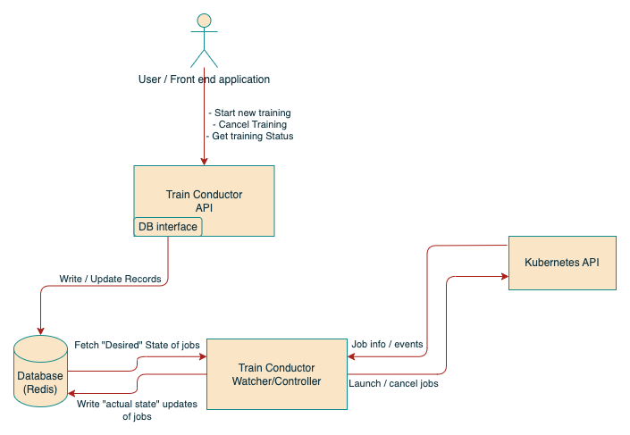
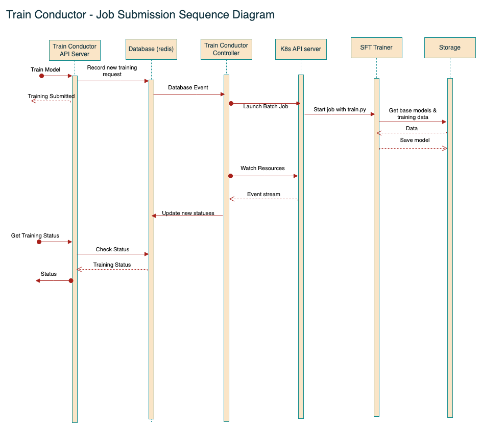

# Train Conductor
:warning: EXPERIMENTAL :warning:

Train Conductor is a lightweight Python-based tool for the deployment and management of Kubernetes batch jobs. It is comprised of three components:
* API Server (gRPC) - This serves training-related requests to the end user. Any changes requested by the user are recorded into the database.

* Watcher/Controller - This component reads desired state of training requests (i.e. new requests, modification of existing requests) and accordingly sends requests to the Kubernetes API server in order to launch new or cancel exiting training requests. It also watches the kubernetes API server and records state changes of the running jobs, and records them in the database.

* Database - Currently implemented in Redis. Train Conductor assumes the existence of the database, the user will provide the connection information as part of configuration.

## Architecture Diagram

Below is an example flow of how a new training request is managed.

